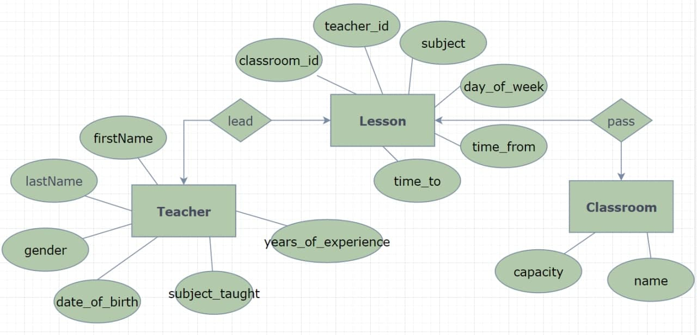
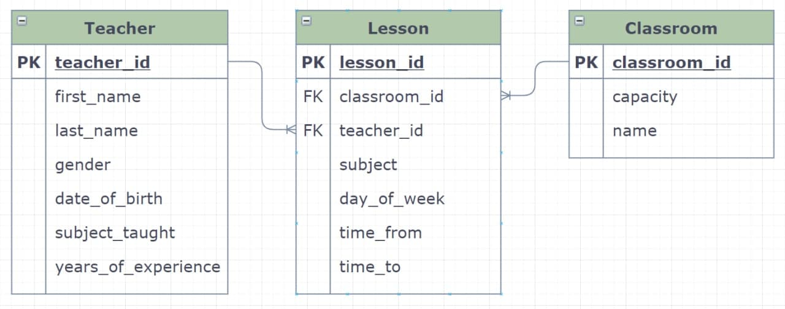
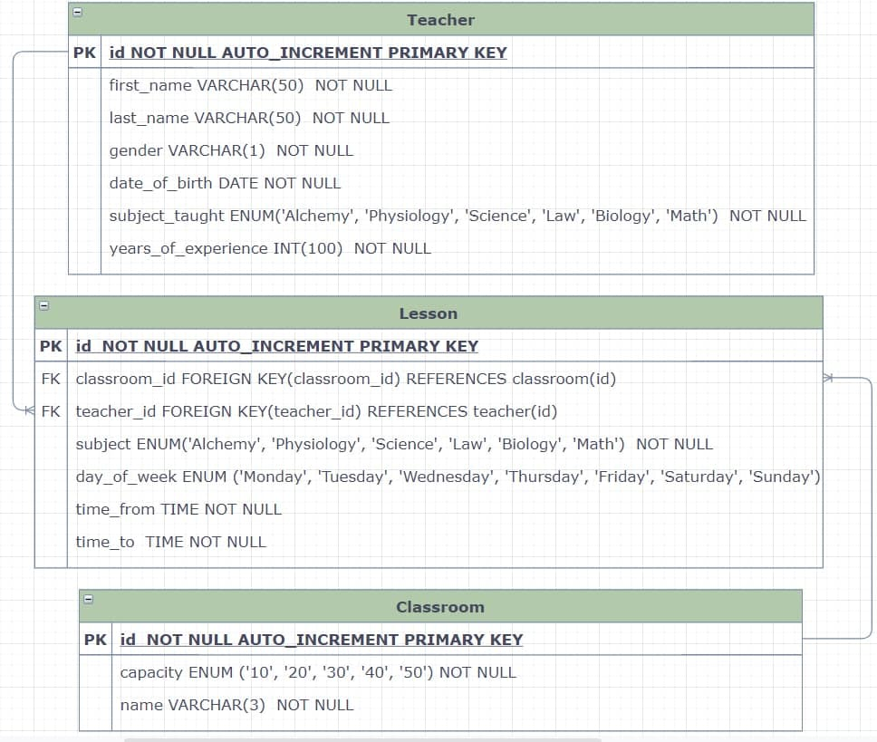
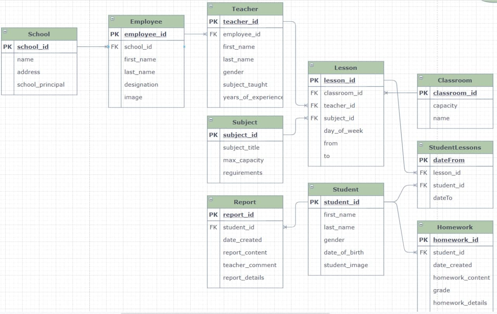
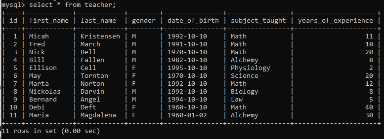
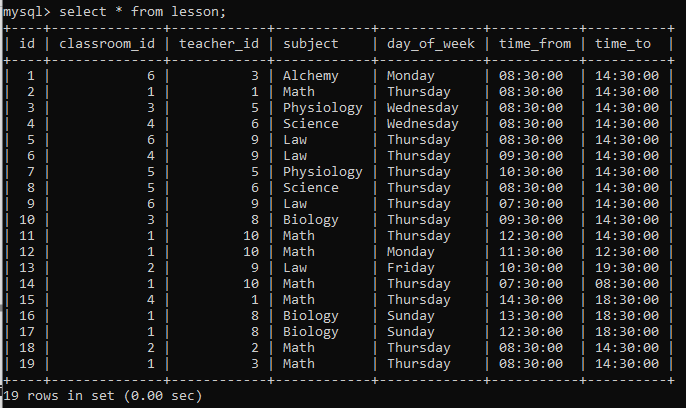
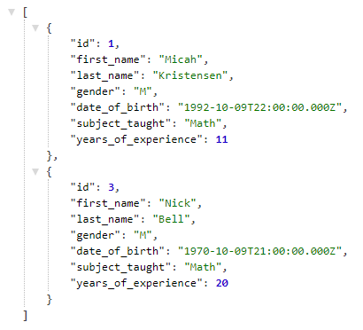
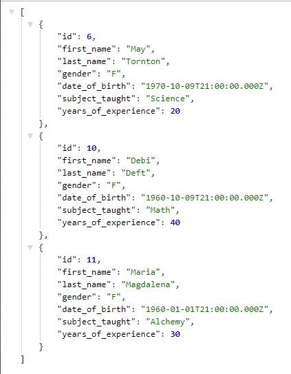

# school-api

## DB structure visualization

***

* Conceptual database model

* Logical database model

* Physical database model

* Future database model

***

## DB content examples

* Teachers

* Lessons

* Classrooms

* getTargetMathTeachers(get all math teachers who have more than 10 years of experience and teach in the classroom
  number 100 every Thursday between 8:30 and 14:30.)

* getTeachers(get all female teachers with experience more then 15 years)

***
You should clone this repository and run command *npm install* to download dependencies

Then run *npm run dev* to start our server. When you see in the console the server is running on the **** port. Open
your browser on localhost(****).

***

## TEACHER operations about teacher

***POST / teachers*** Create teacher

***GET / teachers?gender=F&yearsOfExperience=15limit=5*** Read all teachers

***GET / teachers / {id}?yearsOfExperience=20*** get teacher with id=?

***GET / teachers / mathTeachers?subjectTaught=Math&yearsOfExperience=5&dayOfWeek=Monday&timeFrom=12:00:00&timeTo=13:00:
00&classroomName=105&limit=20*** get all math teachers who have more than 10 years of experience and teach in the
classroom with number 100 every Thursday between 8:30 and 14:30.

***PUT / teachers / {id}*** update teacher with id=?

***DELETE / teachers / {id}*** delete teacher with id=?

