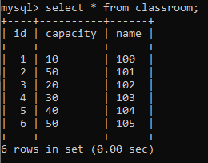

# school-api

## DB structure visualization

***

* Conceptual database model

* Logical database model

* Physical database model

* Future database model

***

## DB content examples

* Teachers

* Lessons

* Classrooms

* getTargetMathTeachers(get all math teachers who have more than 10 years of experience and teach in the classroom
  number 100 every Thursday between 8:30 and 14:30.)

* getTeachers(get all female teachers with experience more then 15 years)

***
You should clone this repository and run command *npm install* to download dependencies

Then run *npm run dev* to start our server. When you see in the console the server is running on the **** port. Open
your browser on localhost(****). 
Try type such urls after localhost:****

/teachers

OR

/teachers/mathTeachers

OR

/teachers/1(any existing id in database)

Also you can **ADD** **UPDATE** and **DELETE** teachers.

